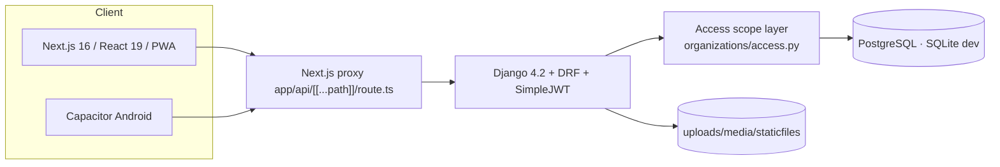
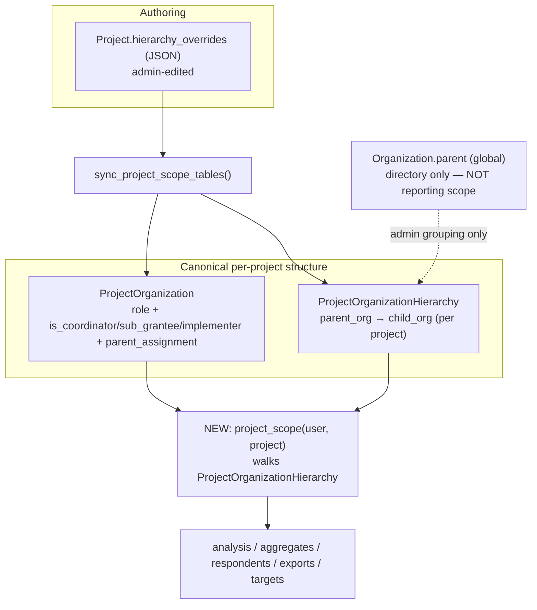
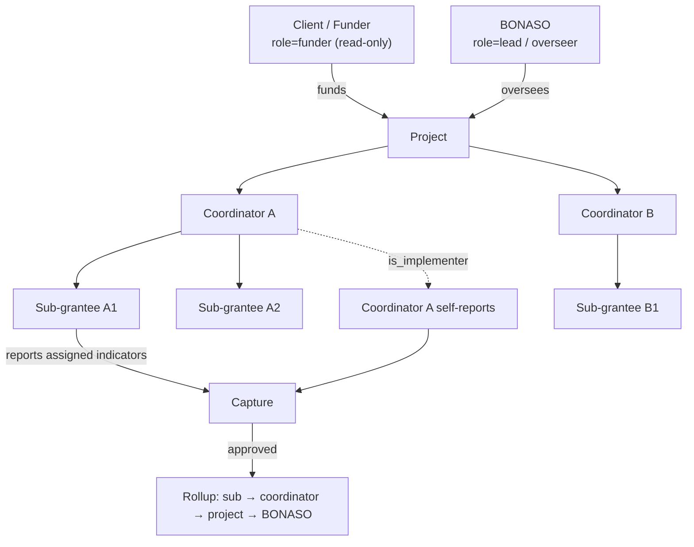
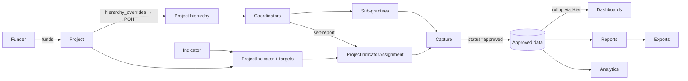
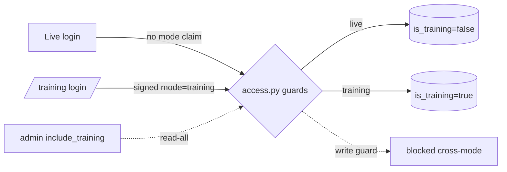

# Sesigo Data Portal — Assessment + Project-Hierarchy Implementation Plan

**Prepared:** 2026-06-09
**Companion to:** `docs/SESIGO_SYSTEM_ASSESSMENT_2026-06-09.md` (full module/workflow assessment). This document **builds on** that one and adds the decisive product decision: *project hierarchy becomes the single operational source of truth.* Where a section is unchanged from the companion, it is summarised and cross-referenced rather than repeated.
**Evidence base:** live source under `/home/bonasoadmin/BONASOV1`, verified file-by-file. Unconfirmable items are marked **Needs confirmation**.

---

## A. Executive Summary

**What it is.** The **Sesigo Data Portal** (*Powered by BONASO*) is a web + mobile platform for programme monitoring, reporting and accountability across a network of funded organisations. It replaces spreadsheet-based quarterly reporting with structured, role-scoped, auditable data: capture → review → approve → dashboard/report/export.

**Who uses it & how they fit.**
- **BONASO** — overseer/M&E authority; governs projects, approves data, reports to funders.
- **Funders / Clients** — fund projects (`ClientOrganization`), need read visibility.
- **Coordinators** — manage a cluster of sub-grantees per project; may also report indicators directly.
- **Sub-grantees / Implementers** — capture data against assigned indicators.
- **Data collectors** — enter aggregate and respondent data, increasingly offline.

**Live vs Training.** `Sesigo Live System` (normal routes) and `Sesigo Training Mode` (`/training/...`) are separated by a **signed `mode` JWT claim** (`organizations/access.py`), not a URL flag — the strongest control in the system. `Project.is_training` is the data flag; training projects now carry `training_expires_after_days` (default 7) but **no cleanup job runs yet**.

**Ready for ordinary users?** Partially. The data model and core flows are sound and the two-tier review (Officer reviews/flags/rejects → Manager approves) is now wired (2026-06-09). But the system is **powerful and heavy**: long project setup, filter-dense dashboards, expert-only imports, and — most importantly for this decision — **organisation visibility/approval/rollups currently key on the *global* org tree, not project hierarchy.**

**Biggest risks/gaps.**
1. **Hierarchy conflict (this decision):** runtime scoping uses `Organization.parent` (global), while the project-hierarchy tables are maintained but **not consulted** by dashboard/aggregates/respondents. (Critical for correctness of cross-project orgs.)
2. **Local-only backups, no tested restore.** (Critical, data safety.)
3. **Thin permission tests** on a procedurally-enforced access model. (High.)
4. **Weak aggregate `value` validation.** (High, silent bad data.)
5. **No persistent Live/Training banner; no training TTL.** (Medium UX/ops.)

---

## B. Current System Architecture

(See companion §B for full detail; summary + the hierarchy-relevant runtime path here.)



- **Frontend:** Next.js App Router, SWR, Radix/Tailwind, service worker + IndexedDB offline (`lib/offline/*`). Browser calls `/api/*`; the catch-all proxy forwards to `BACKEND_API_URL` (502 JSON on backend down).
- **Backend:** Django/DRF apps: `users, organizations, projects, indicators, aggregates, respondents, events, flags, analysis, uploads, messaging, social, profiles` (+ `core`). Routes in `core/urls.py`.
- **Auth:** JWT (`/api/users/request-token|token/refresh|me|logout`), throttled (`login 10/min`, etc.). Training binds a **signed `mode` claim** into the token.
- **Access model:** `permission_classes` is mostly `[IsAuthenticated]`; real gating is procedural via `organizations/access.py` (`is_organization_admin` ×49, `can_review_aggregates`/`can_approve_aggregates`, `get_user_organization_ids`).
- **Deployment:** Docker Compose (`frontend/compose.server.yaml` live: FE:13000, BE:18000); `docker-entrypoint.sh` runs migrate→collectstatic→gunicorn. Prod boot-guards refuse SQLite/open-CORS when `DEBUG=False`.

**Authentication flow**
```mermaid
sequenceDiagram
  participant U as User
  participant F as Frontend
  participant A as Django
  U->>F: credentials (+ mode=training?)
  F->>A: POST /api/users/request-token/
  A-->>F: access+refresh JWT (signed mode claim if training)
  F->>A: GET /api/users/me/ (Bearer)
  A-->>F: user{role, organization}
  Note over F,A: 401 → token/refresh; offline replay re-reads token
```

**Production risks:** local-only backups; unpinned deps + Django 4.2 LTS clock; no unified audit log; dashboard computed per-request (no cache).

---

## C. Complete Module Inventory

Unchanged from the companion (§C lists all 29 modules with backend app, frontend route, status). The hierarchy-relevant subset:

| Module | Backend | Frontend | Hierarchy relevance |
|---|---|---|---|
| Projects | `projects` `/api/manage/` | `/projects` | owns hierarchy tables |
| Project hierarchy | `ProjectOrganizationHierarchy`, `ProjectOrganization.parent_assignment`, `Project.hierarchy_overrides`, `projects/hierarchy.py`, `project_scope_sync.py` | project detail screens | **the decision** |
| Organizations | `organizations` | `/organizations` | global `parent` tree |
| Coordinator/Sub-grantee/Implementer | `ProjectOrganization` facets | within `/projects` | role per project |
| Indicators / assignments | `indicators`, `ProjectIndicatorAssignment` | `/indicators` | who reports what |
| Targets | `ProjectIndicator`, `ProjectIndicatorOrganizationTarget`, `analysis.CoordinatorTarget` | `/targets/coordinators` | per-org/coordinator rollup |
| Aggregates / approvals | `aggregates` | `/aggregates` | scoped by **global** tree today |
| Dashboard / analytics | `analysis` | `/dashboard`, `/analysis` | scoped by **global** tree today |
| Respondents | `respondents` | `/respondents` | scoped by **global** tree today |

Full inventory (Login, Live/Training, Clients, Users, Reports, Exports, Events, Social, Messaging/Notifications, Flags, System status, Offline, Search, Settings, Assessments, Uploads): **see companion §C**. Confirmed during this pass: `/request-access` has **no backend handler**; `/search` is **per-resource DRF `SearchFilter`**, not unified; no dedicated **audit-log** module (`UserActivity` + flags + import jobs only).

---

## D. Module-by-Module Operational Assessment

Full per-module breakdown (purpose, users, FE/BE files, endpoints, models, in/out, deps, steps, pain points) is in **companion §D**. Material changes since that doc:

- **Approvals (D.15):** now **two-tier** — `can_review_aggregates` (admin/manager/officer) gates review/flag/reject/delete; `can_approve_aggregates` (admin/manager) gates approve/bulk-approve/unflag (`aggregates/views.py`, `organizations/access.py`). Security gap closed: `unflag`→approved previously had no permission check.
- **Projects (D.4 / D.7):** confirmed **three** project-hierarchy representations + global tree — detailed in §E below.
- **Training (D.2):** `Project.training_expires_after_days` exists (default 7); **no scheduled cleanup consumes it yet** (Needs: a purge command + cron).

---

## E. Project Hierarchy Assessment (core)

### E.1 What exists in code (verified)

There are **four** distinct ways org relationships are represented; the runtime reporting code uses the one the product decision wants to *demote*.

| # | Representation | File / model | Role | Consumed by |
|---|---|---|---|---|
| 1 | **Global org tree** `Organization.parent` (+ `get_descendants()`) | `organizations/models.py:5-19`; `organizations/access.py:6-12` | self-referential FK tree | **`get_user_organization_ids`** → used in **11 apps** for visibility/approval/dashboard scoping (`flags, events, organizations, projects, analysis, aggregates, respondents, social, users, messaging.notifications, core.offline_views`) |
| 2 | **`Project.hierarchy_overrides`** (JSON) | `projects/models.py:38`; `projects/hierarchy.py::normalize_project_hierarchy_overrides` | the **authored** project hierarchy: `{parent_org_id: [child_org_id,...]}` | edited via project APIs; **synced down** to #3 and #4 |
| 3 | **`ProjectOrganizationHierarchy`** (rows) | `projects/models.py:317-355` | normalised project parent→child edges, `is_active`, unique per project, self-edge check-constraint | `projects/views.py`, `serializers.py`, `project_scope_sync.py`, `check_project_consistency` |
| 4 | **`ProjectOrganization.parent_assignment`** (self-FK) + facets | `projects/models.py:249-303` | per-project membership: `role` (lead/coordinator/sub_grantee/implementing_partner/data_reviewer/funder/other), `is_coordinator/is_sub_grantee/is_implementer/can_report_indicators`, `cluster`, `parent_assignment` | `projects/views.py`, `serializers.py`, `core/offline_views.py`, `scripts/nahpa_assign.py` |

**Synchroniser:** `projects/project_scope_sync.py::sync_project_scope_tables(project)` takes `hierarchy_overrides` (authored) → normalises → writes `ProjectOrganizationHierarchy` rows and reconciles `parent_assignment`. So **#2 is the input of record; #3 and #4 are derived.** That part is coherent.

### E.2 The actual problem (decisive finding)

> **The reporting/approval/visibility runtime does not consult project hierarchy at all.** A grep across `analysis/`, `aggregates/`, `respondents/` for `ProjectOrganizationHierarchy`, `parent_assignment`, `hierarchy_overrides`, `get_project_organization_scope` returns **nothing**. Those modules scope exclusively through `get_user_organization_ids(user)` = `organization.id + organization.get_descendants()` — i.e. the **global** `Organization.parent` tree (`organizations/access.py:6-12`).

Consequences:
- An org that is a **coordinator in Project A** and a **sub-grantee in Project B** is scoped identically in both, because scoping reads the global tree, not the project role.
- If the global parent tree and the project hierarchy disagree (which they can, since they are edited independently), **dashboards, approvals, and "what I can see" follow the global tree** — contradicting the project hierarchy the admin authored.
- Coordinator target rollups are computed **client-side** (`frontend/components/targets/coordinator-targets-page.tsx`), so even the one place hierarchy "rolls up" is outside the server and outside the project-hierarchy tables.

### E.3 What the system should be able to answer (and where it is today)

| Question | Should resolve via | Today |
|---|---|---|
| Who funds this project? | `ProjectOrganization.client` / `ClientOrganization` | ✓ present |
| Who oversees it? | project role `lead` (BONASO) | ✓ data present, ✗ not enforced in scope |
| Which orgs coordinate it? | `ProjectOrganization.is_coordinator`/role | ✓ present |
| Which sub-grantees under each coordinator? | `ProjectOrganizationHierarchy` / `parent_assignment` | ✓ stored, ✗ not used at runtime |
| Which orgs implement directly? | `is_implementer` + `can_report_indicators` | ✓ present |
| Which indicators can an org report? | `ProjectIndicatorAssignment` | ✓ enforced in aggregate capture |
| Who can approve for which orgs? | project hierarchy subtree | ✗ uses global tree |
| What data should each role see? | project hierarchy subtree | ✗ uses global tree |
| How do totals roll up sub→coord→project→BONASO? | project hierarchy | ✗ client-side, partial |

### E.4 Verdict

Project hierarchy is **well-modelled and well-synchronised but not wired into runtime authority.** The fix is **not** new tables — it is to (a) pick **`ProjectOrganizationHierarchy` as the canonical runtime structure** (authored via `hierarchy_overrides`), and (b) **route scoping/rollups/approvals through it** instead of the global tree.

---

## F. Recommended Project Hierarchy Source of Truth

**Decision:** make **`ProjectOrganizationHierarchy`** the canonical, queried, per-project structure, fed by `Project.hierarchy_overrides` as the editable authoring format and reconciled by `sync_project_scope_tables`. Keep `ProjectOrganization` as the per-project membership/role record (it already holds `role`, facets, `parent_assignment`). **Demote the global `Organization.parent` tree** to "directory/admin grouping only" — never the basis for reporting scope.



**Recommended project hierarchy shape**


---

## G. End-to-End Workflow Maps

Full step-by-step maps (trigger · role · screens · APIs · DB · validation · output · failure · confusion · simplification) are in **companion §E**. Hierarchy-affected deltas:

- **Build project hierarchy:** admin edits `hierarchy_overrides` → `sync_project_scope_tables` writes `ProjectOrganizationHierarchy` + `parent_assignment`. *Simplification:* a visual tree builder (drag sub-grantees under coordinators) writing `hierarchy_overrides`.
- **Coordinator reviews sub-grantee data:** *should* be scoped by project subtree; **today** scoped by global descendants. After §N, route via `project_scope`.
- **Approved data → dashboard rollup:** *should* aggregate up the project hierarchy; **today** flat per-org sums filtered by global scope; coordinator rollup is client-side.

---

## H. Data Flow & Module Linkage



Linkage rules (verified): client funds project (`ProjectOrganization.client`); project role is per-project (`ProjectOrganization.role`); indicators assigned project→org (`ProjectIndicatorAssignment`, enforced at capture); only **approved** aggregates feed outputs, grouped on `Indicator.canonical_id`.

---

## I. Role & Permission Matrix

**Platform roles** (`users.User.role`): `admin`, `manager`, `officer`, `collector`, `client`.
**Project roles** (`ProjectOrganization.role`): `lead`, `coordinator`, `sub_grantee`, `implementing_partner`, `data_reviewer`, `funder`, `other`.

| Capability | admin | manager | officer | collector | client/funder |
|---|---|---|---|---|---|
| View dashboards/reports (in scope) | ✓ all | ✓ subtree | ✓ subtree | ✓ own | ✓ read-only (funded projects) |
| Capture aggregates/respondents | ✓ | ✓ | ✓ | ✓ | ✗ |
| Review / flag / reject / delete | ✓ | ✓ | ✓\* | ✗ | ✗ |
| **Approve** / bulk-approve / unflag | ✓ | ✓ | ✗ | ✗ | ✗ |
| Create projects / hierarchy / indicators / targets | ✓ | ✓ | partial | ✗ | ✗ |
| Manage users | ✓ | partial | ✗ | ✗ | ✗ |
| `include_training` read-all | ✓ | ✗ | ✗ | ✗ | ✗ |
| Export | ✓ | ✓ | ✓ | limited | read-only |

\* org-scoped via `get_queryset` (implemented 2026-06-09).

**Recommendations / findings:**
- **Managers should approve** — done (two-tier). **Coordinators should review sub-grantee data before BONASO approval** — *desired*, but coordinators are project-role, not platform-role; today review rights key on platform role + global scope. After §N, add a "coordinator can review within project subtree" rule.
- **Funders read-only** — `client` role is effectively read-only at capture, but there is **no project-scoped funder view** restricting them to *their* funded projects (**Needs confirmation** of current funder filtering; recommend explicit funder scope).
- **Security:** access is procedural — needs a permission test harness (see §P). "Client" role vs "Client/Funder" org naming collision should be renamed.

---

## J. Live System vs Training Mode Assessment

Full table in **companion §H**. Confirmed/updated:
- **Separation enforced** by signed `mode` JWT claim + `apply_training_filter*` + `assert_project_write_allowed`; admins opt into cross-mode **reads** only (`include_training`), never writes. Strong.
- **Leak checks:** live↔training read/write both blocked; training excluded from live dashboard totals (training filter on approved+live). ✓
- **New since companion:** `Project.training_expires_after_days` (default 7) and `training_notes` exist on the model — but **no cleanup job consumes them** (gap).
- **Gaps:** (1) no persistent **Live/Training banner**; (2) no **training TTL purge**; (3) no **warning before saving real-looking data in Training**; (4) no **seeded demo training project**.



---

## K. Dashboard & Reporting Assessment

(Companion §I has the detail.) Key points + hierarchy implications:
- **Source:** approved `Aggregate` only (`analysis/views.py:131 _approved_aggregates_only`), grouped on `Indicator.canonical_id`; filters: org-scope, project, period, indicator, training.
- **Org scoping uses the global tree** (via `get_user_organization_ids`) — must move to **project scope** (§N) so coordinator/sub-grantee rollups follow project hierarchy.
- **Coordinator rollup is client-side** (`coordinator-targets-page.tsx`) → move server-side, keyed on `ProjectOrganizationHierarchy`.
- **Performance:** per-request computation, no caching/pre-aggregation; watch as data grows.
- **Recommended presets:** collector "My submissions & status"; coordinator "My cluster vs target"; manager "Approvals pending"; BONASO/admin "Project performance". Add an always-visible "Totals show **approved** data only" note.

---

## L. Full Gap Analysis Table

| # | Category | Gap | Evidence | User impact | Tech impact | Risk | Fix | Effort | Priority | Files |
|---|---|---|---|---|---|---|---|---|---|---|
| 1 | Project hierarchy | Runtime scoping uses global tree, not project hierarchy | grep: `analysis/aggregates/respondents` never reference POH/parent_assignment; all use `get_user_organization_ids` (global) | Wrong visibility/rollups for cross-project orgs | Authority split-brain | **Critical** | Introduce `project_scope()` over POH; route scoping through it | Large | Immediate | `organizations/access.py`, `projects/assignment_rules.py`, `analysis/views.py`, `aggregates/views.py`, `respondents/views.py` |
| 2 | Backup | Local-only backups, no tested restore | companion §J#2; `backend/scripts/backup_database.sh` writes local | Data loss on disk failure | — | **Critical** | Off-site replication + tested restore runbook | Medium | Immediate | `backend/scripts/`, ops |
| 3 | Security/Test | Procedural authz, thin tests | `permission_classes` mostly `IsAuthenticated`; ~46→ tests | Silent cross-org leak risk | Regressions undetected | High | Permission/contract test suite | Medium | Immediate | `*/tests.py`, new `tests/` |
| 4 | Data quality | Weak aggregate `value`/disaggregation validation | `Aggregate.value` JSONField, no schema check vs indicator config | Silent wrong numbers | Bad rollups | High | Server-side validation vs indicator config | Medium | Immediate | `aggregates/serializers.py`, `indicators/models.py` |
| 5 | Hierarchy | 3 project reps + global tree → confusion | `hierarchy_overrides`/`POH`/`parent_assignment` + `Organization.parent` | Admin edits don't take effect at runtime | Maintenance burden | High | Declare POH canonical; demote global tree | Medium | Immediate | `projects/*`, docs |
| 6 | Reporting | Coordinator rollup client-side | `coordinator-targets-page.tsx` | Page vs DB drift | Inconsistent totals | Medium | Server-side rollup over POH | Medium | Short | `analysis/views.py`, FE targets |
| 7 | UX | No Live/Training banner | no banner component | Wrong-mode data entry | — | Medium | Persistent badge + colour | Small | Immediate | `components/layout/*` |
| 8 | Training | No TTL purge despite `training_expires_after_days` | field exists, no job | Training clutter | Storage growth | Medium | `purge_training_data` cmd + cron | Small | Short | `projects/management/commands/` |
| 9 | UX | Project setup too complex | companion §D.4 | Setup errors, slow onboarding | — | Medium | Setup wizard incl. hierarchy builder | Large | Short | `app/(dashboard)/projects/*` |
| 10 | Audit | No unified audit log | only `UserActivity`+flags+import jobs | Weak forensics | Compliance | Medium | Central audit on writes/approvals | Medium | Short | new `audit` app |
| 11 | Naming | "client" role vs Client/Funder org | `User.role='client'` + `ClientOrganization` | Confusion | — | Low | Rename role→"Funder Viewer" | Small | Short | `users/models.py`, FE labels |
| 12 | Perf | No dashboard caching/pre-agg | `analysis/views.py` per-request | Slow at scale | Load | Medium | Materialised rollups/cache | Medium | Long | `analysis/*` |
| 13 | Mobile | Not offline-first by default | companion §D.27, capacitor remote default | Field needs internet | — | Medium | Ship `CAP_LOCAL_BUNDLE` | Medium | Long | `frontend/capacitor.config.ts` |
| 14 | Build | Unpinned deps; Django LTS clock | `requirements.txt` `>=` | — | Non-reproducible | Medium | Pin + plan 5.x | Small-Med | Short | `requirements.txt` |
| 15 | UX | Multiple login routes | `/login`,`/users/login`,`/training/login` | Confusion | — | Low | One login + mode selector | Small | Short | `app/(auth)/*` |
| 16 | Docs | No user guide/SOP | dev-facing docs only | Onboarding burden | — | Medium | Produce guides+SOP (§Q/§R) | Medium | Short | `docs/` |
| 17 | Functional | `/request-access` no backend; `/search` not unified | grep: no handler; per-resource SearchFilter | Dead/partial UI; fragmented search | — | Low-Med | Wire/remove; unified search later | Small/Med | Short/Long | `app/request-access`, `app/search` |
| 18 | Permission | Funder not project-scoped to funded projects | **Needs confirmation** | Funders may see too much/little | — | Medium | Explicit funder scope over POH/client | Small | Short | `analysis/`, `access.py` |

---

## M. Priority Implementation Roadmap

**Priority 1 — Data safety & security (Immediate)**
1. Off-site backups + tested restore (Gap 2).
2. Permission/contract tests incl. project-scope (Gap 3).
3. Audit logging for create/update/approve/hierarchy-change (Gap 10, scoped to critical actions first).

**Priority 2 — Correct data & reporting (Immediate→Short)**
4. Server-side aggregate `value` validation (Gap 4).
5. **Project hierarchy as source of truth** — `project_scope()` over POH, routed into analysis/aggregates/respondents (Gap 1, 5). *Staged — see §N.*
6. Server-side coordinator rollups over POH (Gap 6).

**Priority 3 — Easier UX (Short)**
7. Live/Training banner (Gap 7); one login + selector (Gap 15).
8. Project-setup wizard with visual hierarchy builder (Gap 9).
9. Role-based dashboard presets + "approved-only" labels (§K).

**Priority 4 — Training & support (Short)**
10. `purge_training_data` TTL job (Gap 8); seeded demo training project; user guide + SOP (Gap 16).

**Priority 5 — Long-term**
11. Dashboard caching/pre-aggregation (Gap 12); offline-first mobile (Gap 13); dependency pinning + Django 5.x (Gap 14); unified search + request-access (Gap 17).

---

## N. Project Hierarchy Implementation Plan (detailed, staged)

**Goal:** route all visibility/approval/rollup/target/export logic through **`ProjectOrganizationHierarchy`** (authored via `hierarchy_overrides`, synced by `sync_project_scope_tables`), and stop using the global `Organization.parent` tree for reporting scope.

### N.1 Source of truth
- **Canonical (queried):** `ProjectOrganizationHierarchy` (edges) + `ProjectOrganization` (role/facets).
- **Authoring (input of record):** `Project.hierarchy_overrides` → reconciled by `projects/project_scope_sync.py::sync_project_scope_tables`.
- **Keep:** `ProjectOrganization.role`, `is_coordinator/is_sub_grantee/is_implementer/can_report_indicators`, `parent_assignment`, `cluster`; `ProjectIndicatorAssignment`.
- **Deprecate for reporting:** `Organization.parent` as scope basis (keep for admin directory only). Document `hierarchy_overrides` as authoring-only (not separately queried).

### N.2 New shared API (backend)
Add to `projects/assignment_rules.py` (or a new `projects/scope.py`):
- `get_project_subtree_org_ids(project, root_org_id) -> set[int]` — walk `ProjectOrganizationHierarchy` (active) from a root coordinator down. ✅ **built** (`projects/scope.py`).
- `get_user_project_scope(user, project) -> set[int]` — org ids a user may see **within a project**: **no project → empty set (by decision)**; admin→all project orgs; project role lead/funder→whole project; coordinator→own + subtree; sub-grantee/implementer→own; user not in project→empty. ✅ **built** (`projects/scope.py`, `PROJECT_WIDE_ROLES = {"lead","funder"}`).
- Keep `get_user_organization_ids` for non-project, cross-project list endpoints only.

### N.3 Wiring (staged, behind a flag)
Introduce setting `HIERARCHY_SOURCE = "project" | "global"` (default `global`, flip per-env after tests):
1. **Stage A (read parity):** ✅ **helpers built 2026-06-09** — `projects/scope.py::get_user_project_scope` / `get_project_subtree_org_ids` (8 tests in `projects/test_scope.py`, all passing). Next: use them in **read** paths — `analysis/views.py` (dashboard/trends), `aggregates` list/templates, `respondents` list. **Product decision (2026-06-09): hierarchy-scoped data REQUIRES a project to be selected.** With no project the dashboard shows no hierarchy-scoped data (prompt "select a project") rather than falling back to the global tree — so `get_user_project_scope(user, None)` returns `set()` by design. Add parity tests comparing old vs new for current data while a project is selected.
2. **Stage B (approvals):** allow project `coordinator`/`data_reviewer` to review within their project subtree (extend `can_review_aggregates` with a project-scope check); keep approve at manager/admin.
3. **Stage C (rollups):** move coordinator rollup server-side over POH (`analysis` endpoint), replacing `coordinator-targets-page.tsx` client math.
4. **Stage D (exports/targets):** route `aggregates.export` and target screens through project scope.
5. **Stage E (flip default):** set `HIERARCHY_SOURCE="project"`; keep global fallback for legacy list endpoints only.

### N.4 Serializer/API changes
- Project detail serializer: expose a single `hierarchy` tree (coordinators → sub-grantees, with role/facets) computed from POH — one canonical read shape for the frontend tree view.
- Validation: reject `hierarchy_overrides` edges where child is not in project org scope (already enforced in `normalize_project_hierarchy_overrides`); add cycle prevention beyond self-edge.

### N.5 Migration plan for existing data
- No schema change required to *start* (tables exist). Run `sync_project_scope_tables` for every project to ensure POH matches `hierarchy_overrides`.
- **Reconciliation report:** for each project, diff global-tree descendants vs POH subtree per org; surface conflicts to admins to resolve before flipping `HIERARCHY_SOURCE`. Build on `projects/management/commands/check_project_consistency.py`.
- Backfill: where POH is empty but a global parent/child relationship was being relied on, generate POH edges from current `ProjectOrganization` membership + existing `parent_assignment`.

### N.6 Frontend
- Project detail: a **visual hierarchy builder** (tree; drag sub-grantee under coordinator; mark implementer/funder) writing `hierarchy_overrides`.
- All org pickers within a project filter by project scope, not global org list.
- Coordinator dashboard ("My cluster") reads the server rollup.

### N.7b User → project assignment gate (decision 2026-06-09)

Two scope dimensions now compose: **(a) which projects** a user may touch (project assignment), and **(b) which orgs within a project** they may see (project hierarchy).

- **Model:** `Project.assigned_users` M2M → `users.User` (`related_name='assigned_projects'`), migration `projects/0017_project_assigned_users.py`. A user may be assigned to many projects; a project to many users. **Admins/staff are exempt** (see all).
- **Helpers** (`projects/scope.py`): `get_user_project_ids(user)` (set, or `None` for admin = all), `user_can_access_project(user, project)`. The project-assignment gate is folded into `get_user_project_scope` — a non-admin not assigned to the project resolves to `set()` regardless of org/hierarchy.
- **Default/current project (decision):** because hierarchy data requires a selected project, the UI must **always preselect one**. `get_default_project_id(user, include_training=False)` returns the most recent **active** accessible project (fallback: most recent accessible of any status; Live excludes training). Frontend preselects this on dashboard load and persists the last choice; switching projects re-scopes everything.
- **Wiring (staged, with go-ahead):** project list endpoints filter to `assigned_projects` for non-admins; dashboard/aggregate/respondent reads call `user_can_access_project` before scoping; `/me` (or dashboard meta) returns `default_project_id` so the frontend can preselect.
- ✅ **Built + tested:** model + migration + helpers + folded into scope; `projects/test_scope.py` now 16 tests (assignment gate, admin exemption, default-project incl. training exclusion). **Not yet wired** into runtime list/read endpoints.

### N.7c Runtime wiring — STATUS (2026-06-09)

The scope helpers are now **wired into the live read paths** (previously they were build-only). All backend changes are additive and **safe**: the project gate only ever narrows, and a transitional backfill prevents lockout.

**Done + tested (backend, full suite 97 green):**
- **Shared gate** `projects/scope.py::filter_queryset_by_assigned_projects(qs, user, project_field, include_null_project=False)` — admin → all; user with assignments → narrowed; user with **no** assignments → **unchanged** (org scope still applies; never locks out).
- **#1 Project list** (`projects/views.py::ProjectViewSet.get_queryset`) — non-admins see only assigned projects (or ones they created).
- **#2–#6 Dashboard** (`analysis/views.py::DashboardView.overview`) — always resolves a project: uses the requested `project`, else `get_default_project_id`; enforces `user_can_access_project`; org scope from `get_user_project_scope` (project hierarchy, **not** the global tree); returns `{code:'no_project', detail:'No assigned project.', default_project_id}` when none; success payload now includes `selected_project_id` + `default_project_id`.
- **#7 `/me`** (`users/views.py::current_user`) — returns `default_project_id`.
- **Other modules gated** (assignment gate layered on existing org scope): aggregates (`project_id`), interactions (`project_id`), responses (`interaction__project_id`), events / participants / phases (`event__project_id`, null-project kept), coordinator targets (`project_id`), offline bootstrap (org base + gate). **Respondents, reports, uploads have no project FK** → not ORM-gateable; documented as follow-ups (need a project FK or a different scoping key).
- **#9 assignment management (backend)** — admins set `Project.assigned_users` via `ProjectSerializer` (admin-gated `validate_assigned_users`) and `User.assigned_projects` via `UserCreate`/`UserUpdate` serializers; `UserSerializer` exposes `assigned_projects` (read).
- **Safe rollout** — migration `0017_project_assigned_users` (M2M) + `0018_backfill_assigned_users` (assigns **all existing users to all projects**, per decision, so nobody is locked out; admins narrow per-user afterward).
- **Tests:** `projects/test_runtime_scope.py` (8 API tests: project-list, dashboard default/no-project/rejection, `/me`, aggregates gate), `projects/test_scope.py` (16), `users/test_project_assignment.py` (5).

**Frontend — partial:**
- ✅ `User` type extended with `default_project_id` + `assigned_projects` (`frontend/lib/types.ts`); `/api/users/me/` returns these. Typecheck clean (no new errors; repo uses `typescript.ignoreBuildErrors`).
- ⏳ **#8 dashboard auto-select** and **#9 assignment multi-select UIs** (user form + project page) are NOT yet wired — they require the running app to modify the 700-line widget dashboard and the user/project forms safely. Handoff pointers: dashboard filter init in `app/(dashboard)/dashboard/page.tsx` (default `projectId:"all"` → preselect `me.default_project_id` / overview response `default_project_id`); user form in `app/(dashboard)/users/[id]` + `lib/api/services/users.ts`; project page in `app/(dashboard)/projects/page.tsx` (+ `lib/api/services/projects.ts`) sending `assigned_users`.

### N.7 Regression tests (see §P)
Project-scope visibility; cross-project role independence; coordinator review within subtree; rollup sub→coord→project; funder read-only; export scope; training scope unaffected.

---

## O. User Experience Simplification Plan

(Companion §K expands.) Targeted by audience:
- **Collectors:** "My submissions & status" home; status legend on every grid; inline period/disaggregation hints; empty-state "you can only report **assigned** indicators — ask your coordinator".
- **Coordinators:** single "My cluster" view (sub-grantees + submission status + target progress) from the project hierarchy; simple add/move sub-grantee.
- **Sub-grantees/implementers:** assigned-indicators list; one capture button; clear "submitted → reviewed → approved" tracker.
- **Managers:** "Approvals pending" queue grouped by project/period; bulk approve.
- **Admins:** project-setup wizard (client → hierarchy → indicators → assignments → targets) with a progress checklist.
- **Funders:** read-only project performance for *their* funded projects only.
- **Cross-cutting:** persistent **Sesigo Live System / Training Mode** badge; one login with a Live/Training selector; confirmation dialogs on approve/delete; outcome toasts ("3 rows approved — now on dashboard"); plain-language errors; tooltips on indicator type/disaggregation; "What does this status mean?" link; onboarding checklist seeded in a demo training project.

---

## P. Testing Plan

| Area | Purpose | Scenario | Expected | Test type | Priority |
|---|---|---|---|---|---|
| Auth | token issue/refresh | login live & training | correct claims; training claim signed | API/integration | High |
| Live/Training | no cross-mode leak | training token reads/writes live | denied; live totals exclude training | API | High |
| **Project-hierarchy scope** | visibility follows POH | coordinator sees own+subtree only | matches POH, not global tree | API | **Critical** |
| Cross-project roles | role independence | org=coordinator in A, sub-grantee in B | scope differs per project | API | High |
| Indicator assignment | report gating | capture unassigned indicator | 403 | API (exists) | High |
| Aggregate capture | scope+mode | out-of-scope org / cross-mode | 403 | API (exists) | High |
| Approval (two-tier) | officer vs manager | officer review/flag/reject ok; approve denied | per §I | API (exists, 11 tests) | High |
| Coordinator rollup | server rollup | sub→coordinator totals | equals sum of subtree approved | API | High |
| Dashboard totals | approved-only + scope | mixed statuses, project filter | approved+in-scope only | API | High |
| Exports | scope parity | export vs dashboard | identical totals | API | Medium |
| Upload/import | dry-run vs live | start_import | validated vs imported | API | Medium |
| Offline sync | replay | queued mutations online | applied once (idempotent) | integration | Medium |
| Funder read-only | no writes; own projects | funder capture/approve | 403; sees only funded | API | Medium |
| Backup/restore | recoverability | restore into clean DB | matches snapshot | runbook drill | **Critical** |
| Audit | critical actions logged | approve/hierarchy edit | audit row written | API | Medium |

---

## Q. User Guide Outline

(Full outline in companion §M.) Guides: **Getting Started** (login, role, Live/Training badge) · **Admin** (users/orgs, project setup, **hierarchy builder**, indicators/assignments/targets, approvals, exports, backups) · **Coordinator** (My cluster, manage sub-grantees, self-report, review, targets) · **Sub-grantee/Implementer** (assigned indicators, capture, status tracker, fix flagged) · **Data Capture** (periods, disaggregation, batch, respondents, offline) · **Dashboard** (approved-only, filters, presets) · **Reports/Export** · **Training Mode** (enter, safe practice, graduate) · **Troubleshooting** (401/403, API down, import fails, totals not updating) · **FAQ** ("why lower than I entered?", "why can't I approve?", "am I in training?", "why can't I see this org?").

## R. SOP Outline

1. User account creation (request → admin creates → assign org + platform role → first login → mode check).
2. Project setup (create, set `is_training`, dates, status).
3. **Project hierarchy setup** (author `hierarchy_overrides` via tree builder → verify POH synced).
4. Organization role assignment (per project: lead/coordinator/sub_grantee/implementer/funder).
5. Indicator setup (create/reuse; alias/canonical policy).
6. Indicator assignment (project → org via `ProjectIndicatorAssignment`).
7. Target setup (project / per-org / coordinator).
8. Data entry (assigned indicator + correct period + correct mode).
9. Data validation (collector self-check; server validation).
10. Review & approval (Officer review/flag/reject → Manager approve; coordinator review within subtree after §N).
11. Flagging & correction (flag → comment → resubmit → re-approve).
12. Dashboard review (period close; confirm approved-only).
13. Reporting & export (generate/schedule; scope parity).
14. Training Mode use (demo project; onboarding).
15. **Training data cleanup** (TTL purge job; manual purge).
16. Backup & restore (off-site; tested restore drill).
17. Support escalation (tiers, system-status page, contacts).

---

## S. Final Recommendations

1. **Wire project hierarchy into runtime authority** (the decision) via a staged, flagged `project_scope()` over `ProjectOrganizationHierarchy` — this is the highest-leverage correctness change and unblocks coordinator review, rollups, and funder scoping.
2. **Protect the data first** — off-site tested backups + aggregate validation; these reduce existential risk fastest.
3. **Lock the access model with tests** before flipping the hierarchy default; ship the permission/contract suite alongside Stage A.
4. **Make mode and hierarchy visible** — Live/Training badge + a visual project-hierarchy tree are small changes that remove whole classes of error.
5. **Converge representations** — POH canonical, `hierarchy_overrides` authoring-only, global tree directory-only; document it and enforce in code review.

**Preserve:** project-scoped reporting model, indicator canonicalization, signed Live/Training separation, the existing `hierarchy_overrides → sync → POH` pipeline (it's good — just consume its output).

---

## T. Files/Modules That Need Changes

| Concern | Backend | Frontend |
|---|---|---|
| Project scope authority | `organizations/access.py`, `projects/assignment_rules.py` (+ new `projects/scope.py`), `core/settings.py` (`HIERARCHY_SOURCE`) | org pickers under `app/(dashboard)/projects/*` |
| Dashboard/analytics scope + server rollup | `analysis/views.py`, `analysis/serializers.py` | `app/(dashboard)/dashboard/*`, `components/targets/coordinator-targets-page.tsx` |
| Aggregate scope + approvals | `aggregates/views.py` | `app/(dashboard)/aggregates/*`, `components/aggregates/*` |
| Respondent scope | `respondents/views.py` | `app/(dashboard)/respondents/*` |
| Hierarchy authoring/sync/validation | `projects/hierarchy.py`, `project_scope_sync.py`, `serializers.py`, `views.py`, `management/commands/check_project_consistency.py` | project detail hierarchy builder |
| Aggregate validation | `aggregates/serializers.py`, `indicators/models.py` | capture forms |
| Training TTL | new `projects/management/commands/purge_training_data.py` + cron | banner in `components/layout/*` |
| Audit log | new `audit` app + signals | — |
| Backups | `backend/scripts/` + ops/cron | — |
| Login/UX | `users/*` | `app/(auth)/*`, `components/layout/app-sidebar.tsx` |
| Tests | `*/tests.py`, new permission/scope suites | `frontend` tests |

---

## Immediate Next Actions (first 10)

1. **Off-site backups + one tested restore drill** (`backend/scripts/`) — Critical, no code risk.
2. ✅ **Done** — `get_user_project_scope()` + `get_project_subtree_org_ids()` in `projects/scope.py` over `ProjectOrganizationHierarchy` (no runtime wiring yet); encodes the "project required" decision.
3. ✅ **Done (initial)** — `projects/test_scope.py` (8 tests) covers subtree walk, admin/lead/coordinator/sub-grantee/outside-user scope, and no-project→empty. Extend with cross-app permission tests next.
4. ✅ **Done** — `Project.assigned_users` M2M + migration `0017`; helpers `get_user_project_ids` / `user_can_access_project` / `get_default_project_id` folded into project scope (`projects/scope.py`); 16 tests pass. Next: wire into project-list + read endpoints and expose `default_project_id`.
5. **Add `HIERARCHY_SOURCE` setting** (default `global`) and a reconciliation report (extend `check_project_consistency`) diffing global-tree vs POH per project.
6. **Stage A:** in `analysis/views.py`, when a `project` filter is present, derive org scope from `get_user_project_scope`; **when no project is selected, return no hierarchy-scoped data** (prompt to select a project). Frontend **preselects `get_default_project_id`** so a project is always selected by default. Add parity tests.
6. **Server-side aggregate `value` validation** against indicator config (`aggregates/serializers.py`).
7. **Move coordinator rollup server-side** over POH; retire client math in `coordinator-targets-page.tsx`.
8. **Persistent Live/Training badge** + a read-only project **hierarchy tree** view (`components/layout/*`, project detail).
9. **`purge_training_data` command** honouring `training_expires_after_days` + cron; create a **seeded demo training project**.
10. **Publish the User Guide + SOP** (§Q/§R) and rename the `client` role to remove the funder/role naming clash.

*Needs confirmation: current funder/client read scoping (whether funders are limited to their funded projects); whether any list endpoint genuinely requires the global tree post-migration; exact behaviour of `get_project_organization_scope_ids` vs the proposed `project_scope` (reconcile before Stage A).*
