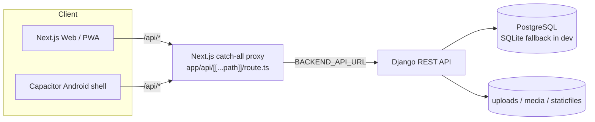
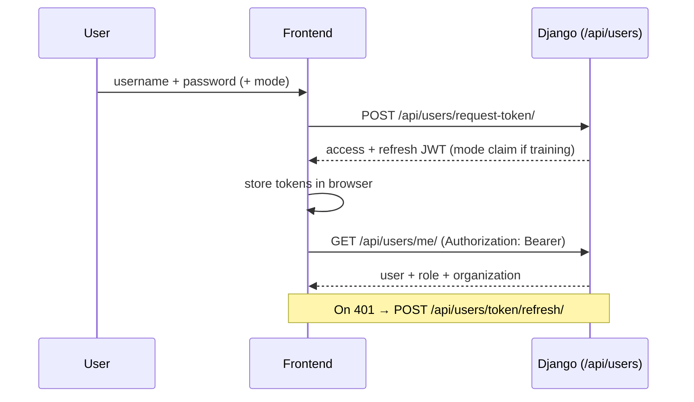
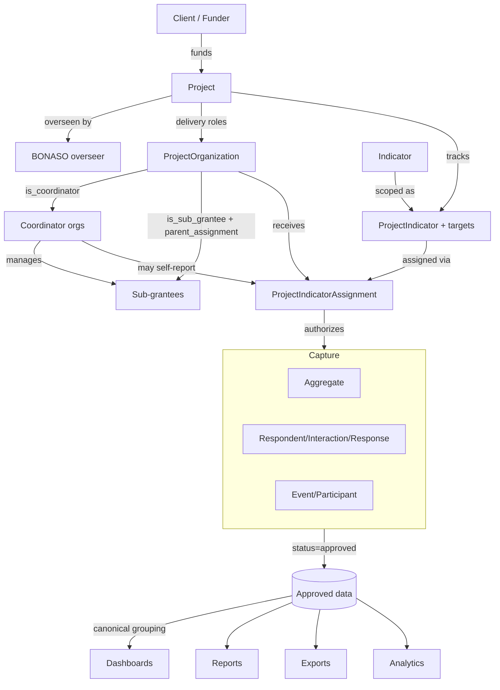
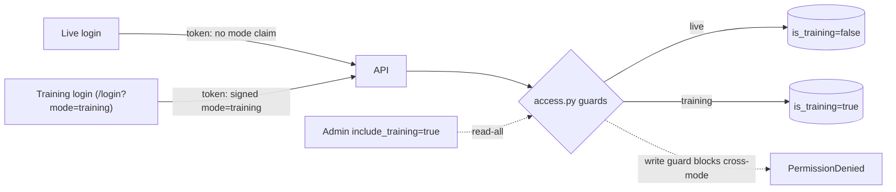

# Sesigo Data Portal — Full System Assessment

**Prepared:** 2026-06-09
**Scope:** Architecture, modules, workflows, roles, Live vs Training separation, dashboards, gaps, UX, roadmap, user-guide & SOP outlines.
**Evidence base:** `/home/bonasoadmin/BONASOV1` (backend Django REST, frontend Next.js), plus existing `SYSTEM_HANDOVER.md` and `docs/sesigo-system-map.md`, verified against live source.

> Convention used throughout: claims are tied to specific files. Where the code does not let me confirm something, it is marked **Needs confirmation**.

---

## A. Executive Summary

**What it is.** The **Sesigo Data Portal** (built and operated by **BONASO**, tagline *Powered by BONASO*) is a web and mobile platform for **programme monitoring, reporting, and accountability** across a network of organisations delivering health/social programmes (HIV prevention, NCD, etc.). It replaces spreadsheet-based quarterly reporting with a structured, role-scoped, auditable system.

**Who it serves.**
- **BONASO** — the overseer/M&E authority that governs projects, reviews and approves data, and reports upward to funders.
- **Funders/Clients** — organisations that fund projects and need visibility.
- **Coordinator organisations** — manage a cluster of sub-grantees and may also deliver/report indicators directly.
- **Sub-grantee / implementing organisations** — capture field data against assigned indicators.
- **Field data collectors** — enter respondent-level and aggregate data, increasingly offline.

**Problem it solves.** It enforces a single chain of truth: *a funder funds a project → BONASO oversees it → coordinators and sub-grantees deliver it → each org reports only the indicators assigned to it → data is reviewed and approved → approved data feeds dashboards, exports, and analytics.* It also provides a **Training Mode** so staff can learn safely without polluting official figures.

**Overall maturity.** The system is in **controlled live rollout** (per project memory). The core data model is mature and well-designed; the operational paths (capture → review → approve → dashboard) work; Training/Live separation is enforced server-side via a signed token claim (a genuine security control, not a UI trick). The main weaknesses are **breadth of the UI relative to the average user's needs**, **thin automated test coverage on critical paths**, **local-only backups**, and a number of **UX clarity gaps** that make the system feel heavy for non-technical field users.

---

## B. System Architecture

### B.1 Runtime topology

- **Frontend:** Next.js 16 App Router, React 19, TypeScript, Tailwind + Radix UI, SWR for fetching, service worker + IndexedDB for offline. Source: `frontend/`. The frontend never talks to Django directly from the browser — it calls `/api/*` on its own origin, and the catch-all route `frontend/app/api/[[...path]]/route.ts` proxies to `BACKEND_API_URL`, returning `502` JSON when the backend is down (`SYSTEM_HANDOVER.md` §3.3).
- **Backend:** Django 4.2 + DRF + SimpleJWT + Djoser, django-filter, CORS headers, WhiteNoise, OpenPyXL for workbooks. Source: `backend/`, settings in `backend/core/settings.py`, root routes in `backend/core/urls.py`.
- **Database:** PostgreSQL in production (`DATABASE_URL`), SQLite fallback in dev — and production **hard-fails at boot** if `DEBUG=False` on SQLite or with open CORS (`core/settings.py`, confirmed via `SYSTEM_HANDOVER.md` §19.3).
- **Deployment:** Docker Compose. `frontend/compose.server.yaml` is the live entrypoint — frontend on host port `13000`, backend on `18000`, backend reads `/app/.env` and mounts `uploads`, `media`, `staticfiles`, and the frontend `scripts/` folder at `/app/workbook-imports`. `backend/docker-entrypoint.sh` runs migrate → collectstatic → optional fixtures/admin bootstrap → gunicorn.

### B.2 Backend app layout (`backend/core/urls.py`)

| URL prefix | App | Domain |
|---|---|---|
| `/api/users/` | `users` | Auth (JWT), users, roles, activity |
| `/api/organizations/` | `organizations` | Org tree + org-scope access helpers |
| `/api/indicators/` | `indicators` | Indicators, aliases, questions, assessments |
| `/api/manage/` | `projects` | Projects, project-orgs, hierarchy, indicators, assignments, targets, tasks |
| `/api/record/` | `respondents` | Respondents, interactions, responses (PII) |
| `/api/aggregates/` | `aggregates` | Aggregate capture + review/approve workflow |
| `/api/activities/` | `events` | Events, participants, phases, check-in |
| `/api/social/` | `social` | Social media posts |
| `/api/flags/` | `flags` | Data-quality flags + comments |
| `/api/analysis/` | `analysis` | Dashboard, reports, saved queries, scheduled reports, coordinator targets, trends |
| `/api/profiles/` | `profiles` | User profile |
| `/api/uploads/` | `uploads` | Uploads, import jobs, export jobs |
| `/api/messages/` | `messaging` | Messages, announcements, notifications |
| `/api/system/status/` | `core.status_views` | System status page |
| `/api/offline/bootstrap/` | `core.offline_views` | Offline sync-down package |

### B.3 Authentication flow

- Endpoints: `POST /api/users/request-token/`, `POST /api/users/token/refresh/`, `GET /api/users/me/`, `POST /api/users/logout/`.
- Throttling configured in `core/settings.py`: `login 10/minute`, `token_refresh 30/minute`, `password_reset 5/hour`, `event_checkin 30/minute`.
- Offline mutation replay re-reads the current local token before replaying (`SYSTEM_HANDOVER.md` §7).

### B.4 Role & permission model (two layers)

1. **Platform role** — `users.User.role` ∈ `admin`, `manager` (M&E Manager), `officer` (M&E Officer), `collector` (Data Collector), `client`. Default `officer` (`users/models.py:8-17`).
2. **Project-scoped organisation role** — `projects.ProjectOrganization.role` ∈ `lead`, `coordinator`, `sub_grantee`, `implementer`(implied by `is_implementer` default True), `funder` (`projects/models.py:249-303`), plus boolean facets `is_coordinator`, `is_sub_grantee`, `is_implementer`, `can_report_indicators`.

**Critical implementation fact:** authorization is enforced **mostly by queryset org-scoping**, not by DRF permission classes. Across all views, `permission_classes` is `[IsAuthenticated]` 36×, `[IsPortalAdmin]` 2×, `[AllowAny]` 2×. The real gatekeeping is `organizations/access.py::is_organization_admin` (used **49×** across views) plus `.role` checks (13×). Writes call `_assert_write_scope(...)`; review/approve transitions are gated: *"Only admins can review or approve aggregate records."* (`aggregates/views.py:325-326` area). This is a sound pattern but means **security review must read view logic, not just the permission decorators**.

### B.5 Live vs Training separation (architecturally enforced)

`Project.is_training` (`projects/models.py:40`) is the source of truth. Enforcement lives in `organizations/access.py`:
- `token_mode(request)` reads a **signed `mode='training'` JWT claim** — *"the claim is signed, it cannot be forged or removed by a client, unlike the legacy `training_only` query parameter"* (`access.py:35-63`). A training-bound token is locked to training for the session and **cannot escalate to "see everything"**.
- `should_include_training` — only admins, via `include_training=true`, and **never** for a training-bound token.
- `apply_training_filter` / `..._to_projects` / `..._via_projects` — read filters.
- `assert_project_write_allowed` — write guard: live tokens cannot write training projects and vice-versa.

This is the strongest single design decision in the system: mode is bound to the cryptographic session, not the URL.

---

## C. Complete Module Inventory

| # | Module | Backend app/route | Frontend route | Status |
|---|---|---|---|---|
| 1 | Login & Authentication | `users` `/api/users/` | `/login`, `/training/login`, `/users/login` | Live |
| 2 | Live System / Training Mode | `access.py` boundary | normal routes + `/training/...` | Live |
| 3 | Dashboard | `analysis` `DashboardView` | `/dashboard` | Live |
| 4 | Projects (+ Tasks, Deadlines) | `projects` `/api/manage/` | `/projects`, `/projects/tasks`, `/projects/deadlines` | Live |
| 5 | Clients/Funders | `projects` (`ClientOrganization`, `ProjectOrganization.client`) | `/clients` | Live |
| 6 | Organizations (hierarchy) | `organizations` | `/organizations` | Live |
| 7 | Coordinator orgs & Sub-grantees | `ProjectOrganization` + `ProjectOrganizationHierarchy` | within `/projects`, `/organizations` | Live |
| 8 | Users & Roles | `users` | `/users` | Live |
| 9 | Project-specific org roles | `ProjectOrganization.role` | within `/projects` | Live |
| 10 | Indicators (+ aliases) | `indicators` | `/indicators` | Live |
| 11 | Assessments / Questions | `indicators` (`Question`, `Assessment`) | `/indicators/assessments` | Live |
| 12 | Indicator assignments | `ProjectIndicatorAssignment` | within projects/indicators | Live |
| 13 | Targets (project + per-org + coordinator) | `ProjectIndicator(.q1-4)`, `ProjectIndicatorOrganizationTarget`, `CoordinatorTarget` | `/targets/coordinators` | Live |
| 14 | Aggregate data capture | `aggregates` | `/aggregates`, `/batch-record` | Live |
| 15 | Respondent/client-level data | `respondents` `/api/record/` | `/respondents`, `/respondents/interactions` | Live |
| 16 | Uploads / Imports / Exports | `uploads` | `/uploads`, `/uploads/imports` | Live |
| 17 | Approvals / Review workflow | `aggregates` actions + `flags` | `/aggregates` review queue | Live |
| 18 | Reports | `analysis` `ReportViewSet` | `/analysis/reports`, `/reports` | Live |
| 19 | Exports | `aggregates.export`, `uploads.ExportJob` | export buttons | Live |
| 20 | Analytics / Insights / Trends | `analysis` (`trends`, dashboards) | `/analysis`, `/analysis/dashboards` | Live |
| 21 | Events / Activities (+ check-in) | `events` `/api/activities/` | `/events`, `/checkin/[token]` | Live |
| 22 | Social media | `social` `/api/social/` | `/social` | Live |
| 23 | Notifications / Messages / Announcements | `messaging` | `/messages`, `/announcements` | Live |
| 24 | Flags / Data quality | `flags` | `/flags`, `/data-quality` | Live |
| 25 | Saved queries & Scheduled reports | `analysis` | within analysis | Live |
| 26 | System status / health | `core.status_views` | `/system-status` | Live |
| 27 | Offline field capture | `core.offline_views`, `lib/offline/*` | offline shell + sync panel | Live (web); mobile not offline-first by default |
| 28 | Search | (cross-app) | `/search` | **Needs confirmation** of backend coverage |
| 29 | Settings / Profile | `profiles` | `/settings` | Live |

There is **no dedicated audit-log module**; auditing is partial (`UserActivity` in `users/models.py:45`, plus flags and import-job records). See Gap Analysis.

---

## D. Detailed Module-by-Module Assessment

For brevity each module follows: *purpose → users → key frontend → key backend → models → data in/out → dependencies → user steps → pain points.* Modules with the most operational weight are expanded; thin ones are summarised.

### D.1 Login & Authentication
- **Purpose:** authenticate, issue JWT, bind session to live or training mode.
- **Users:** everyone.
- **Frontend:** `app/(auth)/login`, `app/training/login`, `app/users/login`.
- **Backend:** `users/urls.py`, `users/views.py` (request-token / refresh / me / logout).
- **Models:** `User` (`role`, `organization`), `UserActivity`.
- **In:** credentials (+ optional mode). **Out:** access/refresh tokens (+ signed mode claim), user profile.
- **Depends on:** organizations (user→org). **Depended on by:** everything.
- **Steps:** open `/login` → enter credentials → (Training: use `/login?mode=training` link in sidebar) → land on dashboard.
- **Pain points:** three different login routes (`/login`, `/users/login`, `/training/login`) is confusing; unclear to users which mode they are in after login (see UX section).

### D.2 Live System / Training Mode
- See Section H. Boundary is server-enforced; frontend signals mode by route and the token carries the signed claim.

### D.3 Dashboard
- **Purpose:** headline totals and charts of approved performance vs targets.
- **Backend:** `analysis/views.py::DashboardView` + helpers; `_approved_aggregates_only` (`analysis/views.py:131`) filters to `status='approved'` unless a `status` param overrides.
- **Models:** `Aggregate`, `Indicator`, `ProjectIndicator`, `Project`, `Organization`.
- **Logic:** totals are computed from **approved aggregates only**, grouped on the **canonical** indicator (`Indicator.canonical_id`, `indicators/models.py:91`) so merged/duplicate indicators don't double-count; filtered by org-scope, project, period, indicator; training filter applied (`apply_training_filter`). Detailed in Section I.
- **Pain points:** payload size and the number of filters; non-technical users may not realise pending data is excluded.

### D.4 Projects (+ Tasks, Deadlines)
- **Purpose:** the central reporting boundary. Holds status, training flag, quarterly structure.
- **Backend:** `projects/` under `/api/manage/`.
- **Models:** `Project` (`status`, `is_training`), `Task` (`status`, deadlines), `ProjectIndicator`, `ProjectOrganization`, `ProjectOrganizationHierarchy`.
- **Steps (create):** admin/manager → `/projects` → create → set code/name/dates/status → mark training if applicable → add client → add coordinator orgs → add sub-grantees → assign indicators → set targets.
- **Pain points:** project setup is a long multi-step chain spread across several screens with no guided wizard.

### D.5 Clients / Funders
- **Models:** `ClientOrganization`; linked to projects via `ProjectOrganization.client` (`projects/models.py:267`) and a many-to-many "funds" relationship (per ERD).
- **Pain point:** "Client" the *platform role* vs "Client" the *funder organisation* are different concepts sharing a name — a real confusion risk (see Gap G/role section).

### D.6 Organizations
- **Models:** `Organization` with self-referential `parent` (`organizations/models.py:5-19`) — a true tree.
- **Backend:** `organizations/access.py` is the org-scope authority used everywhere.
- **Pain point:** the *global* org tree (parent/child) and the *per-project* hierarchy (`ProjectOrganizationHierarchy`) are two different hierarchies; users conflate them.

### D.7 Coordinator orgs & Sub-grantees
- **Represented by:** `ProjectOrganization` facets (`is_coordinator`, `is_sub_grantee`) + `parent_assignment` self-FK + `ProjectOrganizationHierarchy` (parent_org/child_org per project) + a JSON fallback `Project.hierarchy_overrides`.
- **Key rule:** the same org can be a coordinator in one project and a sub-grantee/implementer in another, because role lives on the *project link*, not the org.
- **Pain point:** three representations of hierarchy (FK chain, hierarchy table, JSON override) is powerful but a maintenance and correctness risk.

### D.8 Users & Roles
- `/users`; `User.role` platform layer. Admin creates accounts and assigns org + role. Pain point: no self-service request flow visible beyond `/request-access` (**Needs confirmation** of its backend).

### D.9 Indicators (+ aliases, canonicalization)
- **Models:** `Indicator` (`type`, `category`, `unit`, `options`, `sub_labels`, `aggregation_method`, `aggregate_disaggregation_config`, `canonical_indicator`, `is_deprecated`), `IndicatorAlias` (`normalized_name`).
- **Canonicalization:** a non-null `canonical_indicator` marks a row as a merged duplicate; analytics group on `canonical_id`. Aliases resolve alternate import names → canonical (matches the indicator-aliases memory and `docs/INDICATOR_CANONICALIZATION_REPORT.md`).
- **Pain point:** indicator types and disaggregation config are expert-level; ordinary users should rarely touch these.

### D.10 Indicator assignments
- **Models:** `ProjectIndicatorAssignment` (project_indicator + project_organization + organization + `assignment_source` + `is_active`).
- **Rule:** an org can only report an indicator it has an active assignment for. This is the gate the capture validation checks.

### D.11 Targets
- **Three levels:** project-wide (`ProjectIndicator.q1-q4_target`/`target_value`), per-org (`ProjectIndicatorOrganizationTarget.q1-q4`), and coordinator (`CoordinatorTarget`, surfaced at `/targets/coordinators`).
- **Pain point:** three target tables and the coordinator rollup computed **client-side** (`components/targets/coordinator-targets-page.tsx`) → potential drift between what the page shows and what the DB holds.

### D.12 Aggregate data capture (critical path)
- **Models:** `Aggregate` (indicator, project, organization, period_start/end, JSON `value`, `status`).
- **Lifecycle:** `draft → pending → reviewed → approved | flagged | rejected` (`SYSTEM_HANDOVER.md` §8.1). Create/update resets to `pending`; approve syncs project-indicator rollups; flag creates a `Flag`.
- **Backend actions:** `review`, `approve`, `bulk_approve`, `flag`, `reject`, `unflag`, `export` (`aggregates/views.py`). **Two-tier (2026-06-09):** officers/managers/admins may review/flag/reject/delete; only managers/admins may approve, bulk-approve, or unflag. All org-scoped.
- **Pain point:** the JSON `value` field carries disaggregated numbers — the structure must match the indicator config or data is silently wrong.

### D.13 Respondent / client-level data
- **Models:** `Respondent` (unique_id, org, demographics JSON) → `Interaction` (respondent, project, event, date) → `Response` (interaction, indicator, JSON value).
- **PII handling:** `/api/record` responses carry `no-store` cache-control (`core/middleware.ApiCacheControlMiddleware`, `SYSTEM_HANDOVER.md` §19.3). Offline bootstrap includes assigned respondents (PII) — a real data-protection surface.

### D.14 Uploads / Imports / Exports
- **Models:** `Upload`, `ImportJob`, `ExportJob`.
- **Pipeline:** `POST /api/uploads/` then `POST /api/uploads/{id}/start_import/` with `project_id`, period, optional `sheet_names`, `indicator_overrides`, `sheet_org_overrides`, `dry_run`. Backend runs `import_selected_q3_workbook.py` (mounted at `/app/workbook-imports`). Dry-run → `validated`; live → `imported`. Also Django management commands `import_reporting_workbook_live` / `_overwrite`.
- **Pain point:** the import workflow is **expert-only** — requires understanding overrides, dry-runs, and JSON reports; not a self-serve feature.

### D.15 Approvals / Review workflow
- Frontend: `components/aggregates/AggregateReviewQueue.tsx`, `app/(dashboard)/aggregates/hooks.ts`. Single/bulk approve, flag-for-correction, edit-and-resubmit, delete.
- Two-tier (2026-06-09): M&E Officers review/flag/reject their org's data; M&E Managers (BONASO level) give the final approve. This is the quality gate before data hits dashboards.

### D.16 Reports / Saved queries / Scheduled reports
- `analysis` `ReportViewSet`, `SavedQueryViewSet`, `ScheduledReportViewSet`. Reports include narrative uploads (`NarrativeReport` per ERD) and saved dashboards (`Report(report_type='dashboard')` — note from `SYSTEM_HANDOVER.md` §14.3 that "Dashboards" are stored as reports).

### D.17 Exports
- `aggregates.export` (CSV + Excel via OpenPyXL) and `uploads.ExportJob`.

### D.18 Events / Activities
- `Event`, `Participant`, `EventPhase`; public token check-in at `/checkin/[token]` with `AllowAny` + `event_checkin` throttle.

### D.19 Social, Messaging, Flags, System status, Profiles, Search
- `social.SocialPost`; `messaging.{Message,Announcement,Notification}`; `flags.{Flag,FlagComment}`; `core.status_views` → `/system-status`; `profiles` → `/settings`. **Search backend coverage: Needs confirmation.**

---

## E. End-to-End Workflow Maps

Each workflow lists: *trigger · role · screens · APIs · DB effects · validation · output · failure points · confusion risks.*

### E.1 Login (Live)
- **Trigger/role:** any user. **Screens:** `/login`. **APIs:** `POST /api/users/request-token/` → `GET /api/users/me/`. **DB:** reads `User`; writes `UserActivity`. **Validation:** credentials, throttle 10/min. **Output:** live-scoped session (no mode claim). **Failure:** wrong creds (401), throttle (429). **Confusion:** which of three login pages to use.

### E.2 Login (Training)
- Same, via sidebar "Training Mode" → `/login?mode=training`. The issued token carries the signed `mode='training'` claim, binding the whole session to training. **Confusion:** no always-visible banner that says "You are in Training Mode" (see UX).

### E.3 Create a project
- **Trigger:** new programme. **Role:** admin/manager. **Screens:** `/projects` → new. **APIs:** `POST /api/manage/projects/`. **DB:** insert `Project` (status, `is_training`). **Validation:** code/name/dates. **Output:** empty project shell. **Failure:** duplicate code. **Confusion:** must remember to set `is_training` *before* loading any data.

### E.4 Link a client/funder to a project
- **Role:** admin/manager. **Screens:** `/clients` + project page. **APIs:** project-organization create with `client` set / funds relation. **DB:** `ClientOrganization`, `ProjectOrganization.client`. **Confusion:** "client" naming clash.

### E.5 Add coordinator organisations
- **Role:** admin/manager. **APIs:** `POST` project-organization with `is_coordinator=true`, `role='coordinator'`. **DB:** `ProjectOrganization` (+ `ProjectOrganizationHierarchy` root). **Confusion:** coordinator vs implementer facets.

### E.6 Link sub-grantees
- **Role:** admin/manager (or coordinator if permitted). **APIs:** project-organization with `is_sub_grantee=true`, `parent_assignment` → coordinator. **DB:** `ProjectOrganization` + `ProjectOrganizationHierarchy` (parent_org=coordinator, child_org=sub-grantee). **Failure:** orphaned sub-grantee with no parent. **Confusion:** three hierarchy representations.

### E.7 Create / assign indicators
- **Role:** admin/manager. **APIs:** `POST` indicator → `POST` project-indicator → `POST` project-indicator-assignment. **DB:** `Indicator`, `ProjectIndicator`, `ProjectIndicatorAssignment`. **Validation:** indicator type/options sane; assignment ties org to project-indicator. **Confusion:** difference between "indicator exists", "indicator is in this project", and "this org may report it" — three separate steps.

### E.8 Set targets
- **Role:** admin/manager. **Screens:** project page + `/targets/coordinators`. **DB:** `ProjectIndicator.q1-4`, `ProjectIndicatorOrganizationTarget`, `CoordinatorTarget`. **Confusion:** which target level applies; coordinator rollup is client-side computed.

### E.9 Capture aggregate data
- **Trigger:** reporting period. **Role:** officer/collector with assignment. **Screens:** `/aggregates` or `/batch-record`. **APIs:** `POST /api/aggregates/`. **DB:** insert `Aggregate` (status `pending`). **Validation:** org has active assignment; project/indicator/period valid; live/training write guard. **Output:** pending row. **Failure:** value JSON shape mismatch; write guard rejects cross-mode. **Confusion:** disaggregation entry; knowing the period format.

### E.10 Capture respondent data
- **Role:** collector/officer. **Screens:** `/respondents`, `/respondents/interactions`. **APIs:** `/api/record/...`. **DB:** `Respondent`→`Interaction`→`Response`. **PII:** `no-store`. **Confusion:** respondent dedupe by `unique_id`.

### E.11 Review / approve data (two-tier)
- **Trigger:** pending rows. **Roles:** Officer reviews/flags/rejects own-org data → Manager (BONASO) approves. **Screens:** `/aggregates` review queue. **APIs:** `POST /api/aggregates/{id}/review|reject|flag/` (officer+), `.../approve/`, `.../unflag/`, `POST /api/aggregates/bulk_approve/` (manager+). **DB:** update `Aggregate.status`; approve → `sync_project_indicator_total` rollup; flag → `Flag`. **Validation:** `can_review_aggregates` / `can_approve_aggregates`; all org-scoped via `get_queryset`. **Output:** approved data feeding dashboards. **Confusion:** the meaning of each status; that only approved data is counted.

### E.12 Produce dashboard totals
- **Trigger:** dashboard load. **APIs:** `/api/analysis/dashboard/...`. **DB read:** approved `Aggregate` grouped on `canonical_id`, filtered by org/project/period/indicator + training filter. **Output:** charts and totals. **Failure:** large payloads; mis-set filters return empty. **Confusion:** "why is my number lower than what I entered?" → pending not counted.

### E.13 Generate a report
- **Role:** manager/admin. **APIs:** `/api/analysis/reports/`. **DB:** `Report` / `NarrativeReport`. **Output:** saved/scheduled report or uploaded narrative.

### E.14 Create an export
- **Role:** officer+. **APIs:** `aggregates.export` (CSV/Excel) or `uploads` `ExportJob`. **Output:** downloadable file. **Confusion:** difference between export-from-grid and export-job.

### E.15 Separate training from live
- The act of logging in via training, or admins using `include_training`, plus `is_training` on projects and the write guard, is the mechanism. **Confusion:** users unsure whether their work counts.

---

## F. Data Flow & Module Linkage

**Linkage rules (verified):**
- Client **funds** Project (`ClientOrganization` ↔ `Project`; `ProjectOrganization.client`).
- Project has **coordinator** orgs and **sub-grantee** chains (`ProjectOrganization` facets + `ProjectOrganizationHierarchy`).
- Org **role is per-project**, not global (`ProjectOrganization.role`).
- Indicators are assigned to a project (`ProjectIndicator`) and then to an org (`ProjectIndicatorAssignment`).
- Targets bind project + indicator + (optionally) org + quarter.
- **Only approved** aggregates flow to dashboards/exports/analytics, grouped on canonical indicator.

(ERD: see `docs/sesigo-system-map.md` §6 — verified accurate against `projects/models.py`, `aggregates/models.py`, `indicators/models.py`, `respondents/models.py`, `events/models.py`.)

---

## G. Role & Permission Matrix

**Platform roles** (`User.role`):

| Capability | admin | manager | officer | collector | client |
|---|---|---|---|---|---|
| View dashboards/reports (own scope) | ✓ | ✓ | ✓ | ✓ | ✓ (read-only) |
| Capture aggregates/respondents | ✓ | ✓ | ✓ | ✓ | ✗ |
| Edit own org's data | ✓ | ✓ | ✓ | limited | ✗ |
| **Review / flag / reject / delete** (own org scope) | ✓ | ✓ | ✓* | ✗ | ✗ |
| **Approve** (final BONASO sign-off) | ✓ | ✓ | ✗ | ✗ | ✗ |
| Create projects/indicators/targets | ✓ | ✓ | partial | ✗ | ✗ |
| Manage users | ✓ | partial | ✗ | ✗ | ✗ |
| `include_training` read-all | ✓ | ✗ | ✗ | ✗ | ✗ |
| Export | ✓ | ✓ | ✓ | limited | view-only |

\* **Implemented 2026-06-09 (two-tier review).** A new `can_review_aggregates` (`access.py`) = `admin`/staff **or** `manager` **or** `officer` gates the first tier — **review, flag, reject** (and delete is org-scoped, so officers already qualify). A separate `can_approve_aggregates` = `admin`/staff **or** `manager` gates the final **approve** sign-off. Wired into `_mark_review_state`, `bulk_approve`, and `unflag` in `aggregates/views.py`; frontend gates the Approve button + bulk-approve behind approve rights while showing Review/Flag/Delete to officers (`AggregateReviewQueue.tsx`, `aggregates/hooks.ts`, `aggregates/page.tsx`). All actions stay org-scoped via `get_queryset`. Collectors and clients cannot review or approve. **Security fix:** `unflag` (which restores a row to `approved`) previously had **no permission gate at all** — now restricted to approve-rights. Regression tests cover officer review/flag/reject (allowed), officer approve/unflag (denied), collector review (denied).

**Project-scoped org roles** (`ProjectOrganization.role`): `lead`/overseer, `coordinator`, `sub_grantee`, `implementer` (facet), `funder`. These control *participation* (who delivers/reports what), layered on top of org-tree scoping.

**Findings:**
- **Strength:** org-scoping is consistent and centralised (`access.py` used 49×). Training cannot be escalated.
- **Risk (Medium):** authorization is in view logic, not declarative permission classes → easy to miss a scope check when adding an endpoint; needs a test harness.
- **Risk (Medium):** the approve gate keys on org-admin, not platform role — review whether `manager` should approve.
- **Confusion:** "client" the role vs "client" the funder org.

---

## H. Live vs Training Mode Assessment

| Check | Status | Evidence |
|---|---|---|
| Login mode behaviour | ✓ | sidebar `/login?mode=training`; signed claim issued |
| URL routing `/training/...` | ✓ | `app/training/*`, `toTrainingHref` in `app-sidebar.tsx:182` |
| Session/token mode marker | ✓ **(signed, not just localStorage)** | `access.py::token_mode` |
| Backend read filtering | ✓ | `apply_training_filter*` |
| `is_training` DB flag | ✓ | `Project.is_training`, `ProjectOrganization.is_training` |
| Live data leaking into training | ✗ (prevented) | training token sees training only |
| Training affecting live totals | ✗ (prevented) | dashboard applies training filter; totals use approved + live |
| Writes correctly scoped | ✓ | `assert_project_write_allowed` |
| Uploads/reports/events/exports respect mode | ✓ (via project link filters) | filters applied through `project__is_training` |
| Training cleanup / TTL | ✗ **(absent)** | no TTL/purge job found |
| Dedicated training stack | ✓ optional | `training/compose.training.yaml` (own DB, secret, CORS) |

**Verdict:** Separation is **architecturally sound and server-enforced** — the strongest part of the system. **Two gaps:** (1) no automated training-data purge/TTL — training records accumulate (Low-Med); (2) no persistent UI banner clearly telling the user which mode they are in (UX, Medium — users risk entering real data in training or vice-versa).

---

## I. Dashboard & Reporting Assessment

- **Source tables:** `Aggregate` (primary), with `ProjectIndicator` targets, joined via `Indicator.canonical_id`.
- **Approved vs pending:** default `status='approved'` only (`_approved_aggregates_only`, `analysis/views.py:131`); a `status` query param can widen this — meaning a caller *can* include pending if they pass `status=pending,approved`. **Confusion risk:** numbers differ depending on this param.
- **Filters:** organization (org-scope + explicit `organization`/`coordinator`), project, period (`period_start__gte`/`period_end__lte` with date validation), indicator, training filter.
- **Disaggregation:** carried in `Aggregate.value` JSON + indicator `aggregate_disaggregation_config`.
- **Duplicate indicator handling:** grouped on `canonical_id` so merged duplicates don't double count (`indicators/models.py:91`) — a real, deliberate safeguard.
- **Charts:** produced client-side from the dashboard payload (SWR).
- **Risks:**
  - **Payload/performance (Medium):** wide dashboards pull many approved aggregates; no evidence of server-side pre-aggregation/caching — watch as data grows.
  - **Aggregation correctness (Medium):** `aggregation_method` per indicator must be respected consistently across dashboard, rollup, and exports; the coordinator rollup is computed **client-side** (`coordinator-targets-page.tsx`) — a divergence risk from server truth.
  - **"Lower than expected" confusion (High UX):** pending/flagged data invisible by default; users don't know why.
- **Simplification:** ship 2-3 **preset dashboards per role** (collector: "my submissions & their status"; coordinator: "my cluster vs target"; manager: "approvals pending + project performance") instead of a single filter-heavy screen.

---

## J. Gap Analysis

| # | Category | Gap | Evidence | Impact | Risk | Fix | Effort | Priority |
|---|---|---|---|---|---|---|---|---|
| 1 | Security/Test | Authz lives in view logic, thin tests on critical paths | `permission_classes` mostly `IsAuthenticated`; ~46 backend tests, auth/approve/rollup uncovered (`SYSTEM_HANDOVER.md` §14.7) | A missed scope check could leak cross-org data | High | Add contract/permission tests per endpoint; consider declarative scoping mixin | Medium | Immediate |
| 2 | Operational | Backups are **local-only**, no tested restore | `SYSTEM_HANDOVER.md` §14.11, §19.5 | Disk loss = data loss | **Critical** | Off-site replication + documented, tested restore | Medium | Immediate |
| 3 | Role | ✅ **FIXED 2026-06-09** — two-tier review implemented + `unflag` security gap closed | Was: only `admin`/staff could review/approve, though the frontend already enabled managers → 403s. Now: `can_review_aggregates` (admin/manager/officer) gates review/flag/reject/delete; `can_approve_aggregates` (admin/manager) gates approve + bulk-approve + `unflag`. `unflag`→approved previously had **no permission check** (any in-scope user could self-approve a flagged row) — now gated. Frontend shows Review/Flag/Delete to officers, Approve to managers/admins. Org-scoped via `get_queryset`; 11 aggregate tests pass. | Officers run first-tier review; BONASO Managers approve; closed an unauthenticated-approval path | ~~High~~ Resolved | Done | Small | ✅ |
| 4 | UX | No persistent Live/Training mode banner | no banner component found; only sidebar link | Wrong-mode data entry | Medium | Always-visible mode badge + colour | Small | Immediate |
| 5 | Training | No training data TTL/purge | no purge job found | Training clutter grows | Low-Med | Scheduled purge of `is_training` records | Small | Short-term |
| 6 | UX | Project setup is a long manual chain, no wizard | E.3-E.8 span many screens | Setup errors, slow onboarding | Medium | Guided project-setup wizard | Large | Short-term |
| 7 | Data quality | Aggregate `value` JSON shape must match indicator config; weak guardrails | `Aggregate.value` JSONField | Silent wrong data | High | Server-side schema validation against indicator config | Medium | Immediate |
| 8 | Reporting | Coordinator rollup computed client-side | `coordinator-targets-page.tsx` | Page vs DB drift | Medium | Move rollup server-side, single source | Medium | Short-term |
| 9 | Naming | "Client" role vs "Client/Funder" org collision | `User.role='client'` + `ClientOrganization` | Confusion, mis-assignment | Low | Rename role to "Funder Viewer" or org to "Funder" | Small | Short-term |
| 10 | Data model | Three hierarchy representations (FK chain, hierarchy table, JSON override) | `ProjectOrganization.parent_assignment`, `ProjectOrganizationHierarchy`, `Project.hierarchy_overrides` | Inconsistency, bugs | Medium | Designate one source of truth; deprecate JSON override | Medium | Long-term |
| 11 | Performance | No server-side dashboard pre-aggregation/caching | `analysis/views.py` computes per request | Slow as data grows | Medium | Materialised rollups / cache | Medium | Long-term |
| 12 | Mobile | Android shell not offline-first by default | `SYSTEM_HANDOVER.md` §14.9 | Field users need internet | Medium | Ship `CAP_LOCAL_BUNDLE` mode | Medium | Long-term |
| 13 | Audit | No unified audit log | only `UserActivity`, flags, import jobs | Limited forensics | Medium | Central audit trail on writes/approvals | Medium | Short-term |
| 14 | Build | Deps unpinned; Django 4.2 LTS clock | `requirements.txt` `>=`; `SYSTEM_HANDOVER.md` §14.10 | Non-reproducible builds | Medium | Pin deps; plan 5.x | Small-Med | Short-term |
| 15 | UX | Three login routes | `/login`, `/users/login`, `/training/login` | Confusion | Low | Consolidate to one login with mode toggle | Small | Short-term |
| 16 | Docs | No end-user guide/SOP for field users | docs are dev-facing | Onboarding burden | Medium | Produce guides (Sec M/N) | Medium | Short-term |
| 17 | Functional | `/request-access` has **no backend** (no view/url found); `/search` has no unified endpoint (uses per-resource DRF `search` filters) | grep of `*/views.py`, `*/urls.py` found no `request_access` handler; `search` is a SearchFilter on each viewset | `/request-access` likely non-functional; search is fragmented | Low-Med | Wire or remove `/request-access`; consider a unified search endpoint | Small | Short-term |

---

## K. User-Experience Improvement Plan

**Data collector confusions:** which mode they're in; why approved totals differ from entries; disaggregation entry; period format; which indicators they may report.
- Fixes: persistent mode badge; status legend on every grid; inline helper text + format hints; "you can only report assigned indicators" empty-state explaining how to get assigned.

**Coordinator confusions:** managing sub-grantees vs the global org tree; their cluster's performance vs target.
- Fixes: a single "My cluster" view (sub-grantees + their submission status + target progress); clearer add-sub-grantee flow.

**Manager/admin confusions:** which target level applies; approval queue scope; project setup chain.
- Fixes: target-level labels ("Project target / Org target / Coordinator target"); approval queue grouped by project/period with bulk actions (already partially present); a setup wizard.

**Cross-cutting quick wins:** tooltips on indicator type/disaggregation; confirmation dialogs on approve/delete; success toasts that say *what* happened ("3 rows approved, now counted on dashboard"); colour-coded statuses; an in-app "What does this status mean?" link.

**Use Training Mode for onboarding:** ship a seeded training project so new users practice the full capture→review loop safely, then add a "Graduate to Live" checklist.

---

## L. Priority Implementation Roadmap

**Immediate (0-4 weeks)**
1. Off-site backups + tested restore (Gap 2, Critical).
2. Permission/contract test suite on auth, capture, approve→rollup, training boundary (Gap 1).
3. Server-side validation of `Aggregate.value` against indicator config (Gap 7).
4. Persistent Live/Training mode banner (Gap 4).

**Short-term (1-3 months)**
5. Clarify/confirm manager approval rights (Gap 3).
6. Project-setup wizard (Gap 6).
7. Move coordinator rollup server-side (Gap 8).
8. Central audit log (Gap 13); pin dependencies (Gap 14); consolidate login (Gap 15); rename "client" collision (Gap 9); training TTL (Gap 5).
9. Publish user guides + SOP (Gaps 16).

**Long-term (3-12 months)**
10. Single hierarchy source of truth (Gap 10).
11. Dashboard pre-aggregation/caching (Gap 11).
12. Offline-first mobile release (Gap 12); Django 5.x migration.

---

## M. Suggested User Guide Outline

1. **Getting Started** — what Sesigo is; logging in; understanding your role; Live vs Training badge.
2. **Admin Guide** — create users/orgs; set up a project end-to-end; manage indicators, assignments, targets; approvals; exports; backups overview.
3. **Coordinator Guide** — view your cluster; add/manage sub-grantees; self-report indicators; track cluster vs target; resolve flags.
4. **Sub-grantee / Implementer Guide** — find your assigned indicators; capture aggregates and respondents; read submission status; fix flagged data.
5. **Data Capture Guide** — periods, disaggregation, batch record, respondent dedupe, offline capture & sync.
6. **Dashboard Guide** — what the numbers mean; why only approved data counts; filters; reading charts.
7. **Report & Export Guide** — saved/scheduled reports; narrative uploads; CSV/Excel exports.
8. **Training Mode Guide** — entering training; what's safe; practising the full loop; graduating to live.
9. **Troubleshooting** — 401/403, API unreachable, import failures, totals not updating (mirror `SYSTEM_HANDOVER.md` §13).
10. **FAQ** — "Why is my total lower than what I entered?", "Why can't I approve?", "Am I in training?", "Why can't I see this org/indicator?".

## N. Suggested SOP Outline

1. **User account creation** — request → admin creates → assign org + role → first login → mode check.
2. **Project setup** — create project, set training flag, dates, status.
3. **Organization setup** — register org in tree; set parent.
4. **Indicator setup** — create/reuse indicator; alias mapping; canonicalization policy.
5. **Assignment setup** — add to project; assign to orgs.
6. **Target setup** — project, per-org, coordinator targets per quarter.
7. **Data entry** — capture aggregates/respondents within assignment + correct period + mode.
8. **Data validation** — collector self-check; format/disaggregation rules.
9. **Approval process** — review queue → review → approve/flag/reject → rollup.
10. **Reporting process** — generate/schedule reports; upload narratives.
11. **Dashboard review** — period close review; approved-only confirmation.
12. **Training Mode use** — onboarding loop; periodic purge.
13. **Data correction** — flag → comment → resubmit → re-approve.
14. **Support escalation** — tiers, contacts, system-status page, backup/restore runbook.

---

## O. Final Recommendations

1. **Protect the data first.** Off-site, tested backups (Critical) and `Aggregate.value` server-side validation (High) are the two changes that most reduce existential risk.
2. **Lock in the access model with tests.** The org-scoping design is good but enforced procedurally; a permission/contract test suite turns a Medium-High risk into a managed one.
3. **Make mode unmistakable.** A persistent Live/Training badge is tiny work that removes a whole class of user error — and the underlying separation is already strong, so this just surfaces it.
4. **Reduce cognitive load for ordinary users.** Preset role dashboards, a project-setup wizard, status legends, and clearer language address the system's biggest practical weakness: it is powerful but feels heavy.
5. **Resolve the manager-approval question** before scaling rollout — it directly affects who can do the daily review work.
6. **Converge the model long-term.** One hierarchy source of truth, server-side rollups, and dashboard caching keep the system correct and fast as data grows.

**Biggest strengths to preserve:** the project-scoped reporting model, indicator canonicalization, and the cryptographically-bound Live/Training separation. Build new features to respect all three.

*Resolved during this assessment: implemented the intended **two-tier review** — Officers review/flag/reject/delete within their org scope, Managers/admins approve (`can_review_aggregates` / `can_approve_aggregates` in `access.py`), and closed a security gap where `unflag`→approved had no permission check. 11 aggregate tests pass; frontend updated accordingly. Still open (product/infra, not code): off-site backups + tested restore (Critical); whether `/request-access` should be built or removed; `/search` is per-resource only.*
