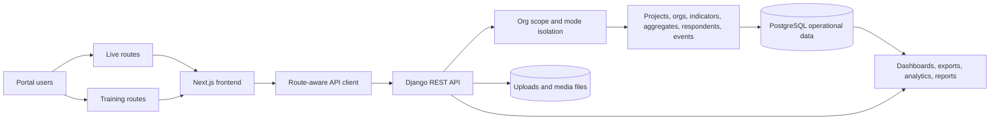
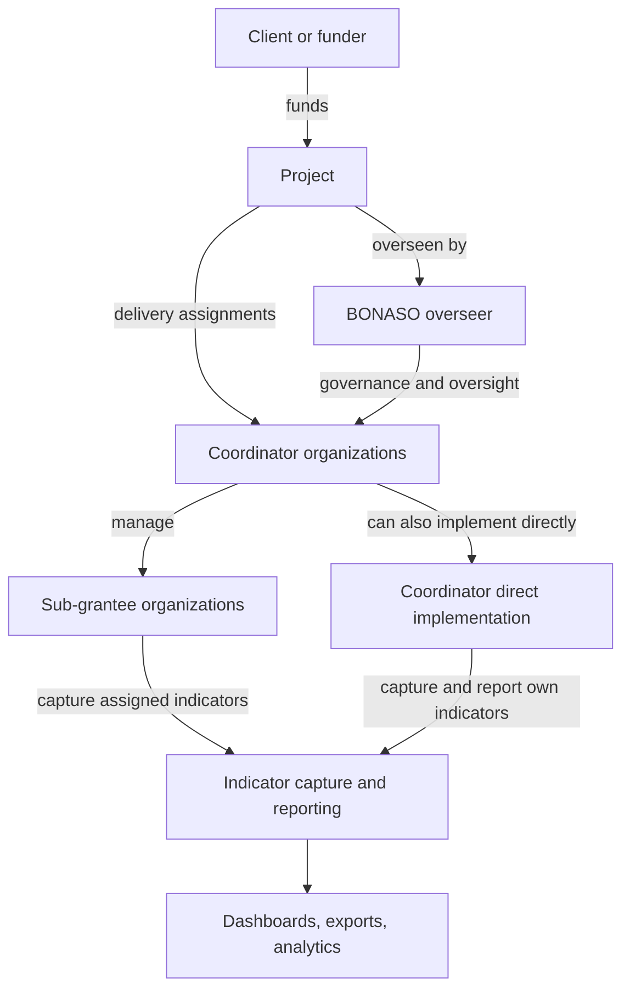
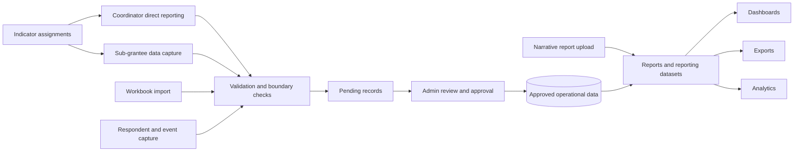
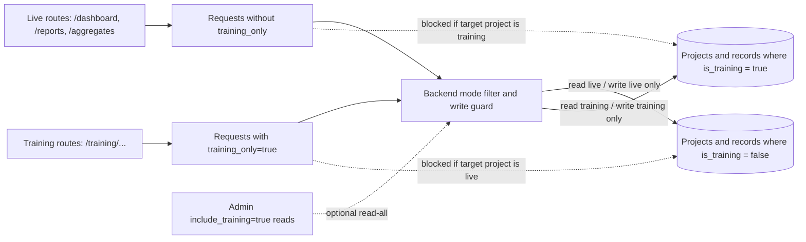
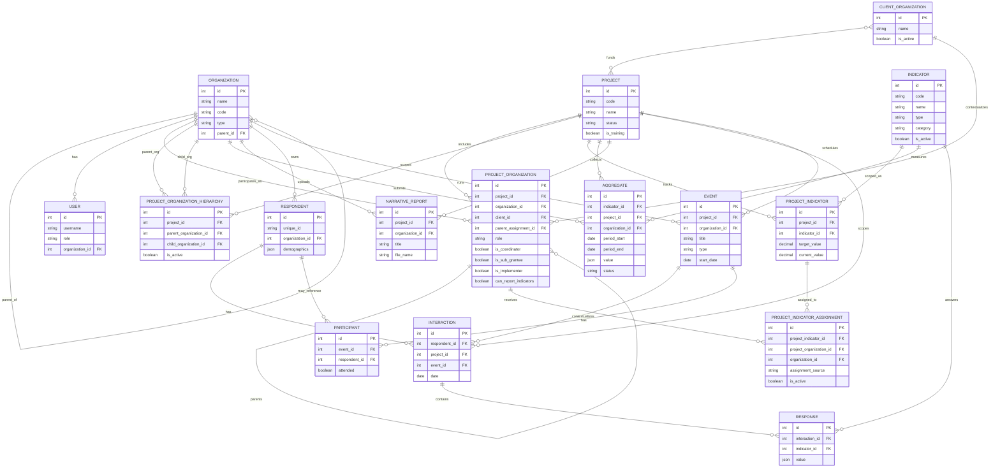

# Sesigo Data Portal System Map

## Purpose

This document maps the current Sesigo Data Portal implementation across architecture, programme hierarchy, access control, data flow, live/training isolation, and the core database model.

## System Summary

- Frontend: Next.js App Router application.
- Backend: Django REST Framework API.
- Primary storage: PostgreSQL-backed operational data plus file/media storage for uploads and narrative reports.
- Core domains: clients/funders, projects, organizations, indicators, aggregates, respondents, interactions, events, analysis, dashboards, and exports.
- Operating modes: `Sesigo Live System` and `Sesigo Training Mode`.

## Non-Negotiable Design Rules

- A client or funder funds a project.
- BONASO sits above project delivery as the overseer.
- Projects are executed through coordinator organizations, with optional sub-grantee chains.
- Coordinators can manage sub-grantees and can also implement and report indicators themselves.
- Sub-grantees capture data against assigned indicators.
- Reports and approved operational data feed dashboards, exports, and analytics.
- Training data must never mix with live data.
- Live pages use normal routes such as `/dashboard`, `/reports`, and `/aggregates`.
- Training pages use `/training/...` routes.
- Training records are scoped using `Project.is_training` plus `training_only=true` or `mode=training` request logic.
- Server-side write guards enforce the boundary even if a user sends the wrong URL or query string.

## Consolidated End-to-End Map

```mermaid
flowchart LR
    CF["Client / Funder<br/>Funds the project"]
    PJ["Project<br/>Reporting boundary"]
    BO["BONASO Overseer<br/>Governance + accountability"]

    subgraph DEL["Project delivery structure"]
        direction TB
        CO["Coordinator Organisations<br/>Manage sub-grantees<br/>Can also self-report"]
        SG["Sub-grantee Organisations<br/>Capture assigned indicators"]
        CD["Coordinator Direct Implementation<br/>Reports own assigned indicators"]
        CO -->|manages| SG
        CO -->|may implement directly| CD
    end

    subgraph FLOW["Indicator and reporting data flow"]
        direction TB
        PA["Project Indicator Assignment<br/>Who reports what"]
        DC["Data Capture<br/>Aggregates, respondents,<br/>events, interactions"]
        VC["Validation + Boundary Checks<br/>Project, org, indicator,<br/>training/live mode"]
        RV["Review / Approval<br/>Pending → approved"]
        OUT["Outputs<br/>Dashboards, reports,<br/>exports, analytics"]
        PA -->|controls reporting| DC
        DC -->|submitted data| VC
        VC -->|valid records| RV
        RV -->|approved data| OUT
    end

    subgraph ISO["Live and training isolation"]
        direction TB
        MF["Mode Filter + Write Guard<br/>Prevents cross-mode writes"]
        LS["Sesigo Live System<br/>/dashboard, /reports, /aggregates"]
        TS["Sesigo Training Mode<br/>/training/..."]
        LD["Live Data<br/>is_training = false"]
        TD["Training Data<br/>is_training = true"]
        LS -->|live only| LD
        TS -->|training only| TD
        MF --> LD
        MF --> TD
    end

    subgraph ARCH["System architecture"]
        direction TB
        FE["Next.js Frontend<br/>Live + /training routes"]
        API["Django REST API<br/>Server-side write guards"]
        DB[("PostgreSQL Database<br/>Operational project data")]
        UP["Uploads / Media<br/>Narrative reports + files"]
        FE -->|API requests| API
        API -->|read/write| DB
        API -->|upload/read| UP
    end

    CF -->|funds| PJ
    PJ -->|overseen by| BO
    BO -->|governs / supports| CO
    PJ -->|assigns delivery scope| CO
    PJ -->|defines| PA
    SG -->|receives assignments| PA
    CD -->|receives assignments| PA

    LS -->|normal routes| FE
    TS -->|training routes| FE
    FE -->|mode-aware requests| MF
    MF -->|enforces boundary| API
    RV -.->|reporting datasets| DB

    classDef core fill:#eaf2ff,stroke:#333,color:#111;
    classDef governance fill:#edf6e8,stroke:#333,color:#111;
    classDef delivery fill:#fdecea,stroke:#333,color:#111;
    classDef flow fill:#fff3e0,stroke:#333,color:#111;
    classDef mode fill:#edf4ff,stroke:#7aa7ff,color:#111;
    classDef system fill:#f5f5f5,stroke:#666,color:#111;

    class CF,PJ core;
    class BO governance;
    class CO,SG,CD delivery;
    class PA,DC,VC,RV,OUT flow;
    class MF,LS,TS,LD,TD mode;
    class FE,API,DB,UP system;
```

This is the one-page system map closest to your reference layout. It combines programme hierarchy, reporting control, live/training isolation, and the technical runtime path into one GitHub-safe Mermaid diagram.

## 1. High-Level System Architecture

The portal uses one web application and one API layer, with route-aware mode handling in the frontend and enforcement in the backend. The codebase also contains an optional dedicated training deployment scaffold, but the current verified user-facing pattern is still `/training/...` on the main portal.

## 2. Client → Project → BONASO → Coordinator → Sub-Grantee Hierarchy

This is the primary programme-delivery shape the codebase supports. In database terms, the hierarchy is represented through `ProjectOrganization`, `ProjectOrganizationHierarchy`, and a JSON fallback in `Project.hierarchy_overrides`, while BONASO is treated as the overseer rather than just another coordinator.

## 3. User Roles and Permissions

```mermaid
flowchart TB
    User[Authenticated user]

    subgraph PlatformRoles[Platform roles]
        Admin[Admin]
        Manager[Manager]
        Officer[Officer]
        Collector[Collector]
        ClientRole[Client]
    end

    subgraph ProjectRoles[Project-scoped organization roles]
        Lead[Lead or Overseer]
        Coordinator[Coordinator]
        SubGrantee[Sub-grantee]
        Implementer[Implementing partner]
        Reviewer[Data reviewer]
        FunderRole[Funder]
    end

    subgraph Capabilities[Typical capabilities]
        C1[Full admin, approvals, training reset]
        C2[Org oversight and coordinator targets]
        C3[Operational editing in allowed scope]
        C4[Field data capture in allowed scope]
        C5[Read-only dashboards and reports]
        C6[Project oversight and accountability]
        C7[Manage sub-grantees and may self-report]
        C8[Capture assigned indicators]
        C9[Direct implementation and reporting]
        C10[Project review support]
        C11[Funding context and visibility]
    end

    User --> Admin --> C1
    User --> Manager --> C2
    User --> Officer --> C3
    User --> Collector --> C4
    User --> ClientRole --> C5

    User --> Lead --> C6
    User --> Coordinator --> C7
    User --> SubGrantee --> C8
    User --> Implementer --> C9
    User --> Reviewer --> C10
    User --> FunderRole --> C11
```

The system uses two role layers. `users.User.role` controls platform access, while `projects.ProjectOrganization.role` controls how an organization participates inside a specific project. Organization-tree scoping further limits what non-admin users can see or change, and admins can also assign explicit Django permissions when needed.

## 4. Data Flow from Data Capture to Dashboard

The core operational path is assignment-driven: organizations only report against indicators that are assigned within project scope. The backend validates organization scope, project scope, indicator assignment, and live/training intent before records become pending, reviewed, and then visible to dashboards, exports, and analytics.

## 5. Training Mode vs Live System Separation

Mode separation is enforced in two places: the frontend marks training requests by route, and the backend applies `apply_training_filter`, `apply_training_filter_to_projects`, `apply_training_filter_via_projects`, and `assert_project_write_allowed`. `Project.is_training` is the source of truth. Admins can opt into cross-mode reads, but writes still cannot cross the boundary.

## Route and Scoping Conventions

| Concern | Sesigo Live System | Sesigo Training Mode |
| --- | --- | --- |
| Route pattern | `/dashboard`, `/reports`, `/aggregates`, `/analysis`, `/projects` | `/training/dashboard`, `/training/reports`, `/training/aggregates`, `/training/analysis`, `/training/projects` |
| Frontend request signal | No training flag by default | `training_only=true` added on reads and writes |
| Project scope | `is_training = false` | `is_training = true` |
| Read behavior | Excludes training-linked records by default | Returns training-linked records only |
| Write behavior | Cannot write into training projects | Cannot write into live projects |
| Shared lists | Hide orgs, indicators, and clients linked only to training projects | Show training-linked orgs, indicators, and clients |
| Admin override | `include_training=true` can expose both for reads | Same read-all override applies, but not to writes |

## Boundary Enforcement Notes

- The URL is the practical mode selector for the frontend.
- The backend, not the browser, is the authority for live/training separation.
- Shared entities such as organizations and indicators are filtered through project links so training-only demo records do not appear in live pickers.
- Training data is designed to be safe to purge or reset without affecting official reporting.
- The repo also includes a dedicated `training/compose.training.yaml` stack for physical training deployment if BONASO chooses to run separate infrastructure later.

## 6. Suggested Database ERD

This ERD is intentionally focused on the core reporting path rather than every auxiliary table. The key architectural pattern is that `Project` provides the reporting scope, `ProjectOrganization` provides the delivery role inside that scope, `ProjectIndicatorAssignment` controls who can report what, and `Aggregate` or `Interaction/Response` records carry the operational data that eventually feeds reporting outputs.

## Recommended Reading of the Model

1. Start with `Project` as the central reporting boundary.
2. Add `ClientOrganization` to understand who funds the work.
3. Add `Organization` plus `ProjectOrganization` to understand who delivers the work and in what role.
4. Add `Indicator`, `ProjectIndicator`, and `ProjectIndicatorAssignment` to understand what each organization is allowed to report.
5. Add `Aggregate` and `NarrativeReport` to understand summarized reporting.
6. Add `Respondent`, `Interaction`, `Response`, `Event`, and `Participant` to understand individual-level and event-linked capture.

## Architectural Conclusions

- Sesigo is a project-scoped reporting platform, not just a generic data-entry system.
- BONASO oversight, coordinator delivery, and sub-grantee capture are first-class business concepts in the model.
- Live/training separation is a core architectural rule, not a UI convention.
- The cleanest long-term scaling path is to keep project-role mapping, indicator assignment, and training isolation explicit in every new feature.
